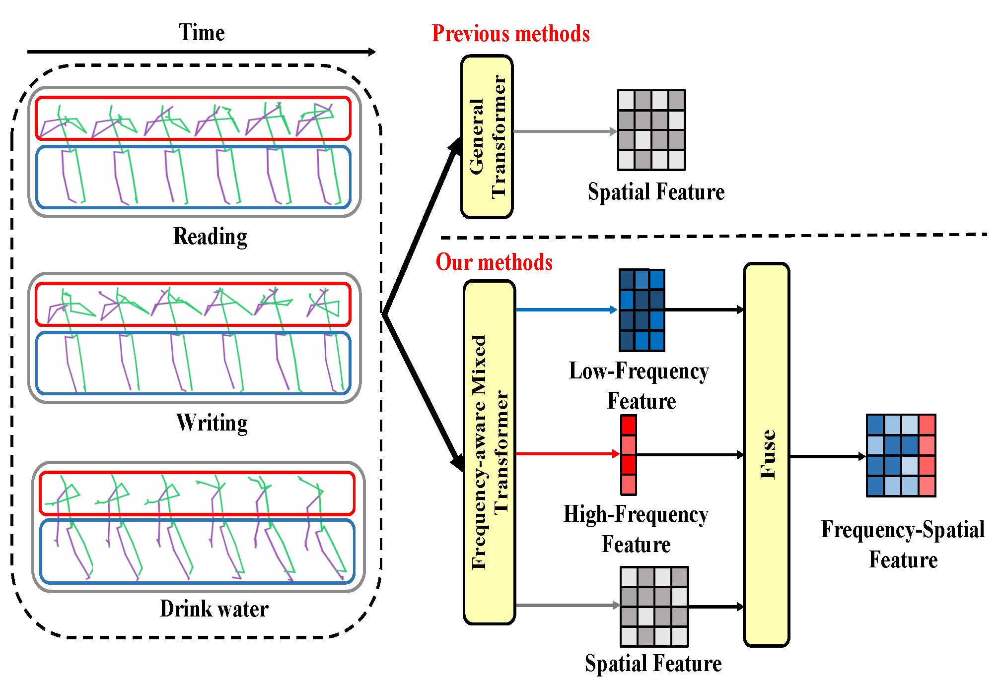
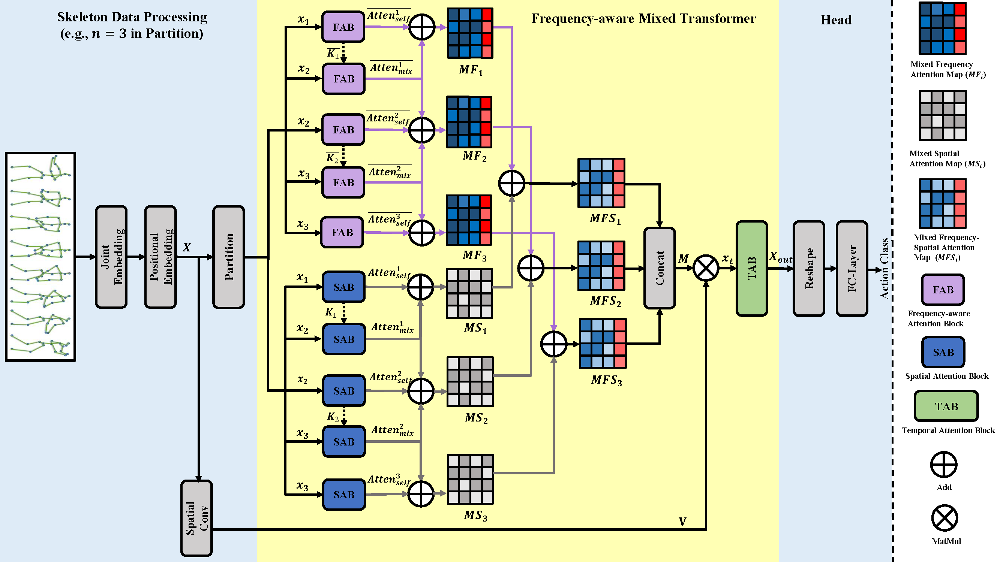
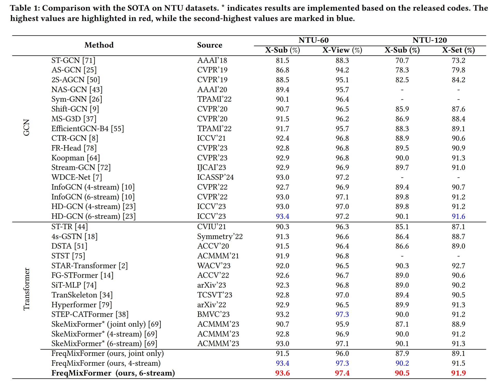

# Frequency Guidance Matters: Skeletal Action Recognition by Frequency-Aware Mixed Transformer
[Wenhan Wu](https://sites.google.com/view/wenhanwu/%E9%A6%96%E9%A1%B5), [Ce Zheng](https://zczcwh.github.io/), [Zihao Yang](https://openreview.net/profile?id=~Zihao_Yang7), [Srijan Das](https://srijandas07.github.io/), [Chen Chen](https://www.crcv.ucf.edu/chenchen/), [Aidong Lu ](https://webpages.charlotte.edu/alu1/)

[](https://wenhanwu95.github.io/FreqMixFormer.github.io/)  [](https://arxiv.org/abs/2407.12322)

## Abstract
Recently, transformers have demonstrated great potential for modeling long-term dependencies from skeleton sequences and thereby gained ever-increasing attention in skeleton action recognition. However, the existing transformer-based approaches heavily rely on the naive attention mechanism for capturing the spatiotemporal features, which falls short in learning discriminative representations that exhibit similar motion patterns. To address this challenge, we introduce the Frequency-aware Mixed Transformer (FreqMixFormer), specifically designed for recognizing similar skeletal actions with subtle discriminative motions. First, we introduce a frequency-aware attention module to unweave skeleton frequency representations by embedding joint features into frequency attention maps, aiming to distinguish the discriminative movements based on their frequency coefficients. Subsequently, we develop a mixed transformer architecture to incorporate spatial features with frequency features to model the comprehensive frequency-spatial patterns. Additionally, a temporal transformer is proposed to extract the global correlations across frames. Extensive experiments show that FreqMiXFormer outperforms SOTA on 3 popular skeleton action recognition datasets, including NTU RGB+D, NTU RGB+D 120, and NW-UCLA datasets. 

## Motivation

The overall design of our Frequency-aware Mixed Transformer. Our FreqMixFormer model overcomes the limitations of traditional transformer-based methods, which cannot effectively recognize confusing actions such as reading and writing due to the straightforward process of skeleton sequences. As highlighted with the colored boxes, the FreqMixFormer introduces the frequency domain and extracts high-frequency features, which often indicate subtle and dynamic movements (red), and low-frequency features, which are associated with slow and steady movements (blue). These features are then fused with spatial features. Our results demonstrate that the integrated frequency-spatial features significantly improve the model's capability to discern discriminative joint correlations.

## Our Approach

We propose a Frequency-aware Attention Block (FAB) to investigate frequency features within skeletal sequences. A frequency operator is specifically designed to improve the learning of frequency coefficients, thereby enhancing the ability to capture discriminative correlations among joints.
Consequently, we introduce the Frequency-aware Mixed Transformer (FreqMixFormer) to extract frequency-spatial joint correlations. The model incorporates a temporal transformer designed to enhance its ability to capture temporal features across frames.

## Results on popular datasets


## Latest Updates:
* Create the GitHub repository and project website on 2024/7/18
* Preprint paper is available on arXiv 2024/7/18

## TODOs:
* Project Website
* Docs for
  * Prerequisites
  * Data Preparation
  * Training & Testing
* Codes for
  * Model
  * Ensemble

## Citation
If you find this code useful for your research, please consider citing the following paper:

```bibtex
@misc{wu2024frequencyguidancemattersskeletal,
      title={Frequency Guidance Matters: Skeletal Action Recognition by Frequency-Aware Mixed Transformer}, 
      author={Wenhan Wu and Ce Zheng and Zihao Yang and Chen Chen and Srijan Das and Aidong Lu},
      year={2024},
      eprint={2407.12322},
      archivePrefix={arXiv},
      primaryClass={cs.CV},
      url={https://arxiv.org/abs/2407.12322}, 
}
```

## Contact
For any questions, feel free to create a new issue or contact:
```
Wenhan Wu: wwu25@uncc.edu
```
